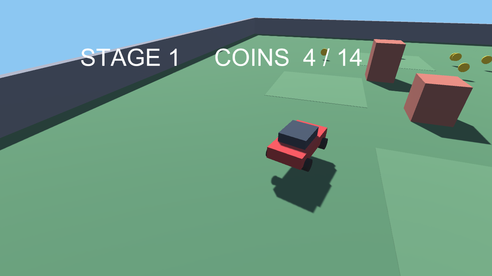

# 🏎️ DRIFT APEX

> ローポリのドリフトサーキットを攻めるタイムアタックレース。ベストラップのゴーストと競い合おう。

ローポリで描かれたサーキットを舞台にしたドリフトタイムアタックゲームです。ワンタッチ操作でステアし、コーナーをスライドさせてスタイルポイントを稼ぎながら、自己ベストラップのゴーストとタイムを競います。


🔗 **[Live Demo](https://masafykun.github.io/drift-apex/)**

---

## 📸 スクリーンショット


---

## 🎮 操作方法
| 操作 | 動作 |
|---|---|
| ワンタッチ | ステア（進行方向の調整） |

コーナーでスライドさせるとスタイルポイントを獲得できます。

---

## ✨ 特徴
- **ドリフトタイムアタック** — サーキットを周回しベストタイムを目指す
- **スタイルポイント** — コーナーをドリフトで攻めるほどポイントが加算される
- **ゴーストとの対戦** — 自己ベストラップのゴーストと同時走行してタイムを競う
- **ワンタッチ操作** — シンプルなステア操作だけで遊べる
- **ブラウザで即プレイ** — WebGL ビルドにより GitHub Pages 上で直接プレイ可能

---

## 🛠️ 技術スタック
| カテゴリ | 技術 |
|---|---|
| エンジン | Unity (6000.0.77f1) |
| 言語 | C# |
| 配信 | WebGL / GitHub Pages |

---

## 🚀 セットアップ
```bash
# ブラウザで直接プレイする場合
# https://masafykun.github.io/drift-apex/ にアクセス

# ローカルで WebGL ビルドを開く場合
# index.html を簡易 HTTP サーバー経由で開く
python3 -m http.server 8000
# ブラウザで http://localhost:8000 を開く
```

C# のソースコードは `src/` 配下にあります。

---

## ライセンス

[](https://opensource.org/licenses/MIT)

このプロジェクトは **MIT ライセンス** のもとで公開しています。

© 2026 masafykun (https://github.com/masafykun)
